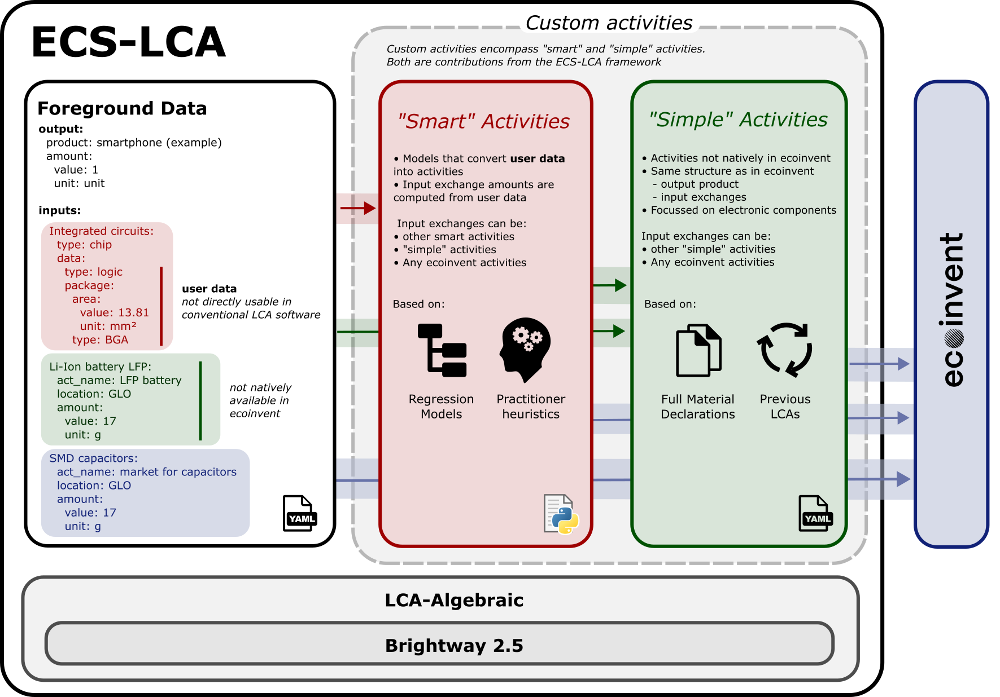
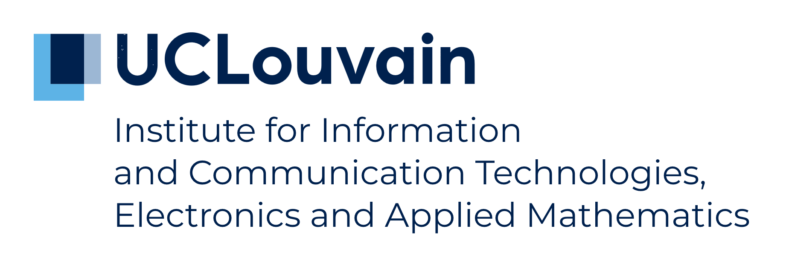
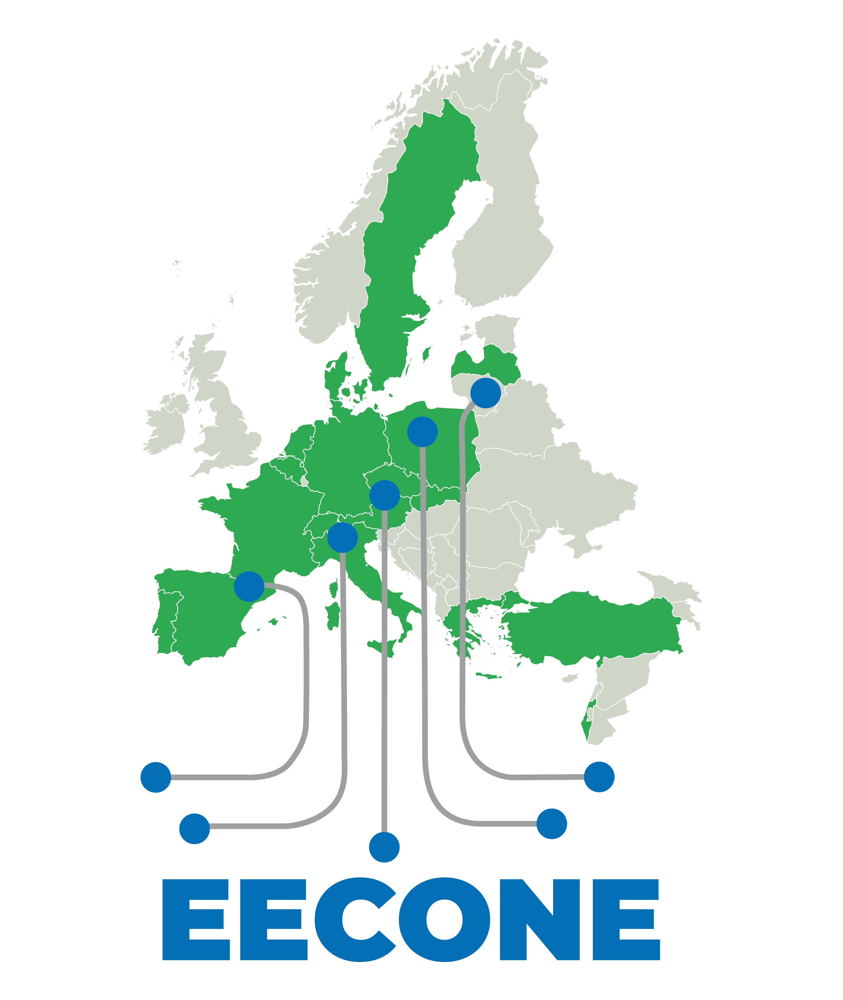
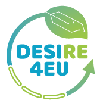

> [!WARNING]  
> Please be aware that this is still a work in progress.
> Breaking changes are to be expected in the future.
# ECS-LCA
ECS-LCA is a life-cycle assessment framework that uses LCA-algebraic and Brightway with human-readable syntax files.


# Installation

Clone this repository.
Dependencies installation will depend on your Python framework.

We recommand you to use [uv](https://github.com/astral-sh/uv).

`manage_database` is an interactive script will ask you for how you wanna get ecoinvent.
It also allows you to change the version or model of the database.


## uv
```
uv venv --python 3.10
uv pip install -r requirements.txt
./scripts/manage_database.py
uv run python -m ipykernel install --user --name=ECS-LCA
uv run jupyter notebook main.ipynb
```

## conda
```
conda create -n ECS-LCA python=3.10
conda activate ECS-LCA
conda install --yes --file requirements.txt
pip install -r requirements.txt
python -m ./scripts/manage_database.py
python -m jupyterlab main.ipynb
```
## pipenv
```
pipenv install -r requirements.txt --python 3.10
pipenv run python -m ipykernel install --user --name=ECS-LCA
pipenv run python -m ./scripts/manage_database.py
pipenv run jupyter notebook main.ipynb
```

# Repo structure
- `main.ipynb` is the notebook from which users can do their LCA.
- `yaml` contains all data describing the foreground. Enter your custom databases in this folder, under custom.
- `src` contains the custom python packages.

# Contact
- david.bol@uclouvain.be
- robin.dethienne@uclouvain.be
- augustin.wattiez@uclouvain.be


# Credits

This project has been developped by the ECS group in the ICTEAM ([Institute of Information and Communication Technologies, Electronics and Applied Mathematics](https://www.uclouvain.be/en/research-institutes/icteam)) at UCLouvain. 



This work was supported by the EECONE project funded by the Chips Joint Undertaking under grant agreement 101112065.



This project has received funding from the European Union’s Horizon Europe EIC Pathfinder Challenges programme under GA N°101161251 (DESIRE4EU).

