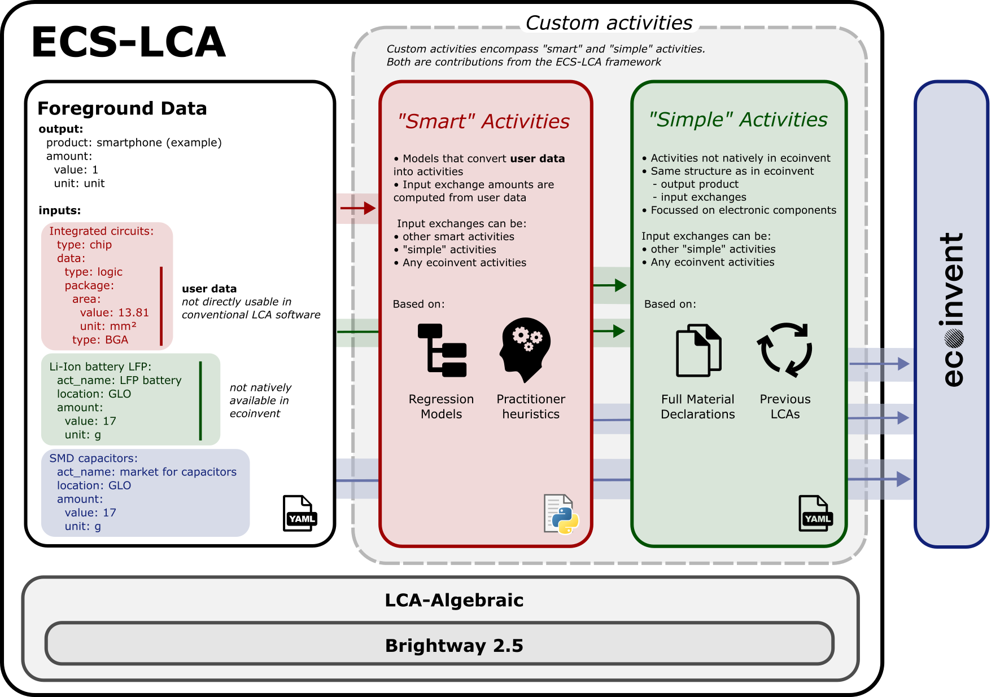
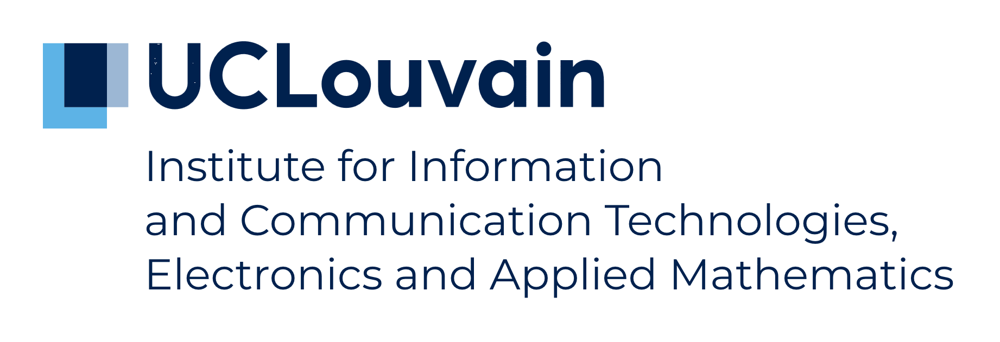
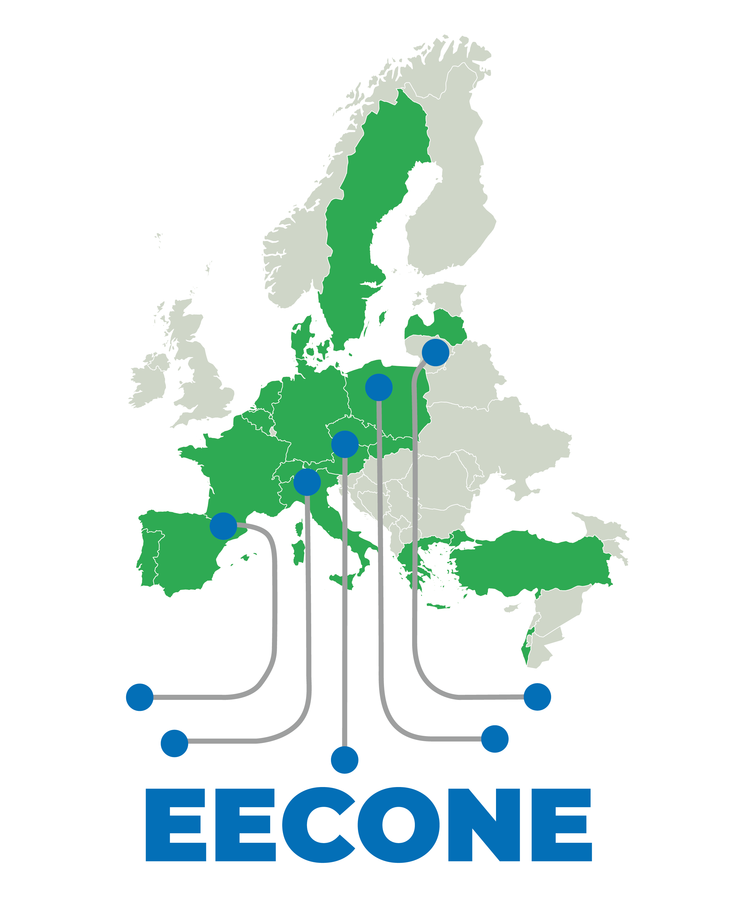
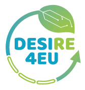

> [!WARNING]
> Please be aware that this is still a work in progress.
> Breaking changes are to be expected in the future.
# ECS-LCA
ECS-LCA is a life-cycle assessment framework that uses LCA-algebraic and Brightway with human-readable syntax files.


# Installation

Clone this repository.
Dependencies installation will depend on your Python framework.

We recommand you to use [uv](https://github.com/astral-sh/uv). Other package manager should be usable but they have not been tested and we offer no specific support for them.

`manage_database` is an interactive script will ask you how you wanna get ecoinvent.
It also allows you to change the version or model of the database.

```
uv sync
uv run manage_database
uv run python -m ipykernel install --user --name=ECS-LCA
uv run jupyter notebook main.ipynb
```

# Example

The folder `example` contains an inventory which calls custom activities. To compute the related impacts, you can run the following command to choose impacts categories you want to compute:
```
uv run method_selector
```
and then compute impacts, which will be found in files `./results/foreground_impacts.csv` and `./results/foreground_stochastic.csv`:
```
uv run treat_foreground ./examples/foreground.yaml -c ./examples/custom 
```

Alternatively, `./examples/main.ipynb` provides an example of how to use the framework from your own python code.

# Contact
- david.bol@uclouvain.be
- robin.dethienne@uclouvain.be
- augustin.wattiez@uclouvain.be


# Credits

This project has been developped by the ECS group in the ICTEAM ([Institute of Information and Communication Technologies, Electronics and Applied Mathematics](https://www.uclouvain.be/en/research-institutes/icteam)) at UCLouvain. 



This work was supported by the EECONE project funded by the Chips Joint Undertaking under grant agreement 101112065.



This project has received funding from the European Union’s Horizon Europe EIC Pathfinder Challenges programme under GA N°101161251 (DESIRE4EU).

